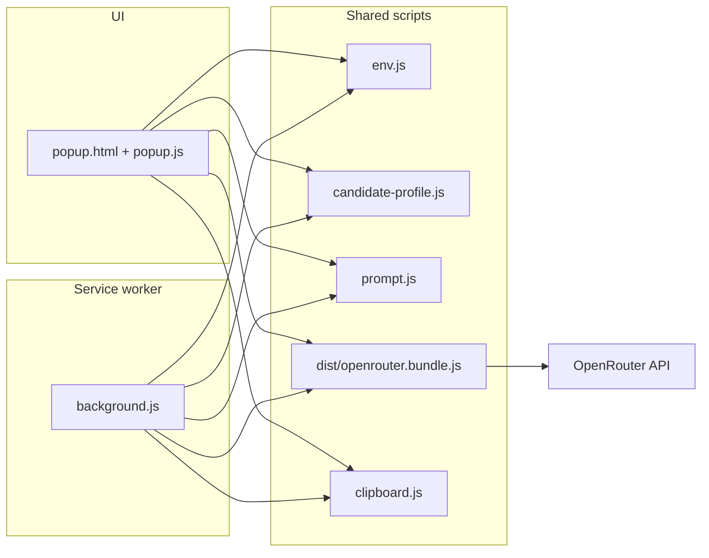

# Cover Letter Generator (Chrome Extension)

A **Manifest V3** browser extension that drafts tailored cover letters from your **saved template**, a **vacancy text**, and a **structured candidate profile**. Generation runs through [OpenRouter](https://openrouter.ai), so you can pick any model OpenRouter supports (OpenAI, Anthropic, and others).

The UI is a compact popup; you can also trigger generation from a **context menu** on selected text or a **keyboard shortcut**. Results can be **copied** or **inserted** into the active editable field on the page when the host site allows scripting.

---

## Features

- **OpenRouter + Vercel AI SDK** — `generateText` with `@openrouter/ai-sdk-provider`, bundled for the extension runtime.
- **Profile-grounded prompts** — `src/api/candidate-profile.js` supplies facts and guardrails; the model is instructed not to invent experience.
- **Shared pipeline** — Popup and background service worker use the same `CoverAPI.generateCoverLetterDetailed` flow.
- **Chrome storage** — Template, job text, and last result persist in `chrome.storage.local` with incremental saves.
- **Delivery helpers** — Clipboard write in-page (with `execCommand` fallback), optional insert into focused `textarea` / `input` / `contenteditable`, toast + optional chime on success.
- **Shortcuts** — Default: **Alt+Shift+L** (see `manifest.json` → `commands`; users can remap in `chrome://extensions/shortcuts`).

---

## Repository layout

```
cover-extension/
├── manifest.json              # MV3 manifest
├── env.example.js             # Copy → src/config/env.js (API key, model, headers)
├── LICENSE
├── package.json
├── src/
│   ├── api/
│   │   ├── candidate-profile.js   # Your structured CV facts (edit for yourself)
│   │   ├── clipboard.js           # Copy / insert / toast (scripting targets)
│   │   ├── openrouter.js          # Source for esbuild bundle (CoverAPI)
│   │   └── prompt.js              # System + user prompt assembly
│   ├── background/
│   │   └── background.js          # Context menu, shortcut, generation orchestration
│   ├── config/
│   │   └── env.js                 # Local only — created from env.example.js (gitignored)
│   ├── pages/
│   │   └── popup.html
│   ├── scripts/
│   │   └── popup.js
│   └── styles/
│       └── popup.css
└── dist/
    └── openrouter.bundle.js   # Produced by npm run build (gitignored)
```

---

## How it works

1. **Popup** loads `env.js`, `candidate-profile.js`, `prompt.js`, the **bundled** OpenRouter client (`dist/openrouter.bundle.js`), `clipboard.js`, then `popup.js`.
2. **Service worker** uses `importScripts` for the same globals (paths resolved via `chrome.runtime.getURL`).
3. **Prompt** (`prompt.js`) merges profile snapshot, achievements, guardrails, optional page title/URL, your template, and the job text.
4. **Background** path: on context menu or command, selected text is stored as `currentOffer`, then `generateAndCopy` runs if both template and job text exist — it tries **insert into focused field** (when possible), **copy to clipboard** in the tab, updates storage and a short history, opens the popup when allowed, and shows a notification.



---

## Prerequisites

- **Chrome** or another **Chromium** browser (Edge, Brave, Arc, etc.)
- **Node.js 18+** and npm (for linting and building the OpenRouter bundle)
- An **OpenRouter API key** ([openrouter.ai](https://openrouter.ai))

---

## Setup

### 1. Clone and install

```bash
git clone <your-fork-or-url> cover-extension
cd cover-extension
npm install
```

### 2. Configure OpenRouter

Create `src/config/env.js` from the root `env.example.js`:

```bash
mkdir -p src/config
cp env.example.js src/config/env.js
```

Edit `src/config/env.js` and set at least `OPENROUTER_API_KEY`. Optional fields include `OPENROUTER_MODEL`, `OPENROUTER_REFERER`, `OPENROUTER_TITLE`, `MAX_TOKENS`, and `TEMPERATURE`.

**Never commit real keys.** `src/config/env.js` is listed in `.gitignore`.

### 3. Build the API bundle

The popup and background load `dist/openrouter.bundle.js`. Generate it after `npm install` or whenever you change `src/api/openrouter.js`:

```bash
npm run build
```

### 4. Customize the candidate profile

Edit `src/api/candidate-profile.js` with your real experience, skills, and `guardrails.doNotClaim` so the model stays honest.

### 5. Load unpacked in Chrome

1. Open `chrome://extensions/`
2. Enable **Developer mode**
3. **Load unpacked** → select the `cover-extension` project root (the folder that contains `manifest.json`)

Reload the extension after code or `manifest.json` changes.

---

## Scripts

| Command          | Description                                                  |
| ---------------- | ------------------------------------------------------------ |
| `npm run build`  | Bundle `src/api/openrouter.js` → `dist/openrouter.bundle.js` |
| `npm run lint`   | ESLint on `src/**/*.js`                                      |
| `npm run format` | Prettier write                                               |
| `npm run check`  | Lint + Prettier check                                        |

---

## Configuration reference (`src/config/env.js`)

| Field                 | Purpose                                                                                     |
| --------------------- | ------------------------------------------------------------------------------------------- |
| `OPENROUTER_API_KEY`  | Required. Your OpenRouter secret.                                                           |
| `OPENROUTER_API_BASE` | Default `https://openrouter.ai/api/v1`                                                      |
| `OPENROUTER_MODEL`    | Any model id OpenRouter accepts (e.g. `openai/gpt-4o-mini`)                                 |
| `OPENROUTER_REFERER`  | Optional `HTTP-Referer` header for OpenRouter rankings                                      |
| `OPENROUTER_TITLE`    | Optional `X-Title` header                                                                   |
| `TIMEOUT_MS`          | Included in the sample config; extend `openrouter.js` if you need an explicit fetch timeout |
| `MAX_TOKENS`          | Passed to `generateText` as `maxTokens`                                                     |
| `TEMPERATURE`         | Sampling temperature                                                                        |

Prompt behavior (length, tone, “no markdown”) is controlled in `src/api/prompt.js`.

---

## Permissions (why they exist)

| Permission                     | Use                                                                 |
| ------------------------------ | ------------------------------------------------------------------- |
| `storage`                      | Template, job text, last output, small generation history           |
| `contextMenus`                 | “Generate Cover Letter” on selection                                |
| `activeTab`                    | Generation tied to the current tab                                  |
| `notifications`                | Status when the popup cannot be opened                              |
| `scripting`                    | Clipboard / insert / toast scripts in the page                      |
| `clipboardWrite`               | Clipboard access from extension contexts                            |
| `tabs`                         | Resolve active tab for context and delivery                         |
| `host_permissions: <all_urls>` | Run scripting on arbitrary sites where the user triggers the action |

For a stricter install, you could narrow host permissions to specific domains (trade-off: generation from arbitrary job boards may break).

---

## Security and privacy

- **API keys in `env.js` are visible to anyone with filesystem access to your profile.** For a published extension on the Chrome Web Store, use a **backend proxy** instead of shipping keys.
- **Vacancy text and templates** stay in local extension storage unless you send them to OpenRouter as part of generation.
- Comply with **OpenRouter** and **model provider** terms of use.

---

## Troubleshooting

- **“CoverAPI is unavailable” / blank generation** — Run `npm run build` and confirm `dist/openrouter.bundle.js` exists.
- **“No OpenRouter API key configured”** — Add `src/config/env.js` from `env.example.js`.
- **“Candidate profile is missing”** — Ensure `src/api/candidate-profile.js` is present and loaded before `prompt.js` (see `popup.html` order).
- **Shortcut does nothing** — Some pages (e.g. `chrome://`) restrict scripting; try a normal HTTPS page with text selected.

---

## License

MIT — see [LICENSE](./LICENSE).

Third-party services (OpenRouter and model providers) have their own terms and billing.

---

## Contributing

Issues and pull requests are welcome. Please run `npm run check` before submitting changes.
